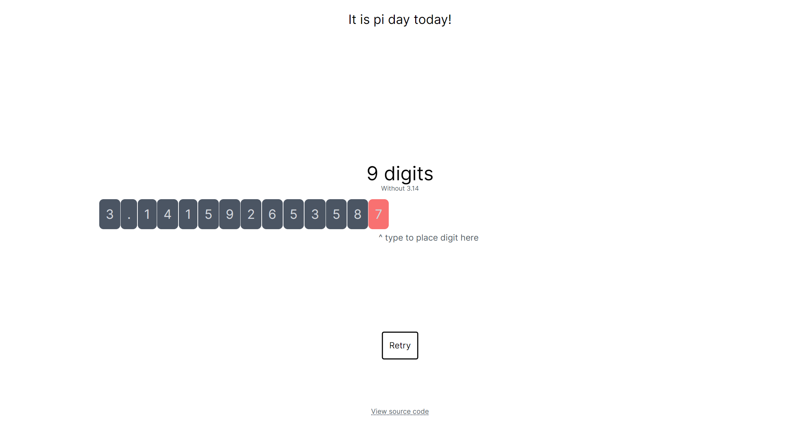

# Pi day 2024

This is a simple app I wrote using Next.js for you to memorize pi,
or see how much you already know

It is available on [pi.riley0122.dev](https://pi.riley0122.dev/)
for anyone to use!

You could also clone this repository, and in the root folder run
`npm i` and `npm start`

